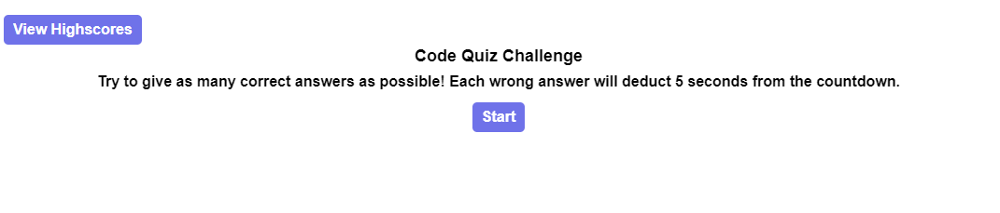
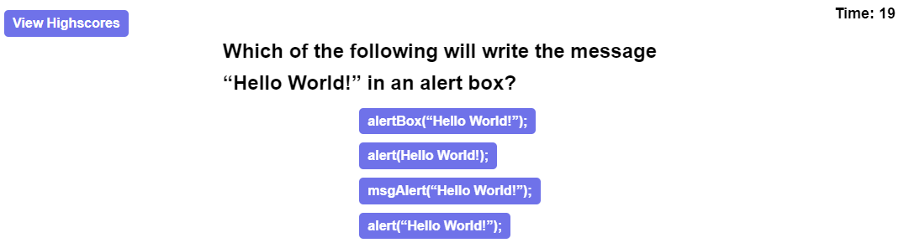
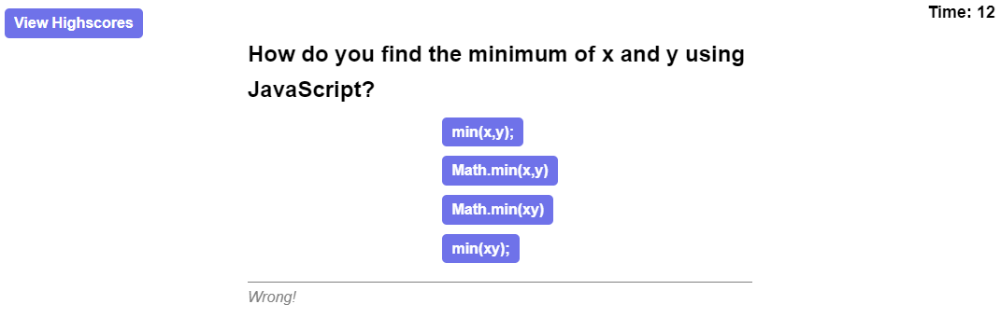
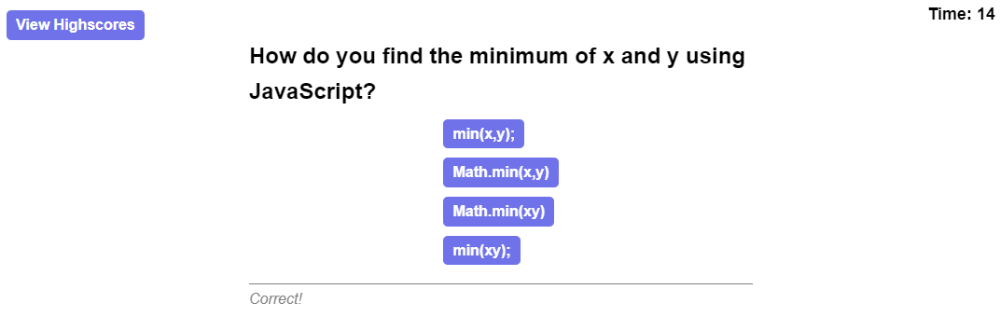
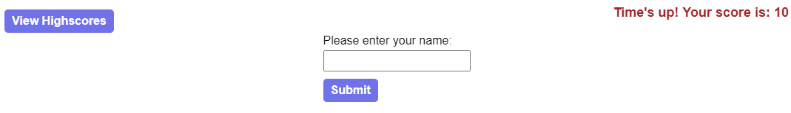
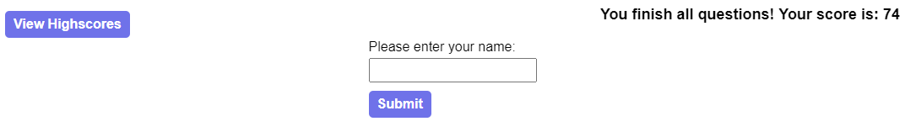

# Javascript Code Quiz

## Overview
Generate a timed quiz for user to test their capabilities. It also will store a score in the local storage for users to review.

## Technology Used
HTML, CSS,  JavaScript, Bootstrap, jQuery


## User Journey
```md
When the user goes to this website, they will be prompted to view history scores and start the code quiz.
```


```md
If the user clicks the highscore page without playing a game, the local storage of history data will be empty, and the user will be prompted to play one game first.
```


```md
After the user goes back to the main page by clicking the back button, he/she can start the quiz game by clicking the start button, and the first question will show up.
```


```md
The user will be able to click on one of the options, and the timer is running down from 20 to 0. If the user makes a wrong choice, the timer will be deducted by 5 seconds, and the user will not get any score for the question. The prompt will say 'wrong!' as well. 
```


```md
If the user selects the correct answer, the prompt will say 'correct!,' and the user gets 10 scores. 
```



```md
If the user runs out of time, the submit score prompt will automatically show up for the user to fill out.
```



```md
Else, if the user did well, and finish all questions before the timer runs out, the remaining time will be added to the final score, and the submit score prompt will also show up.
```



```md
After the user submits the score, he/she will go back to the main screen, and therefore can click the 'highscore' button to check the score history, or try again.
```


## Links
Deployed Page: https://banbanleelee.github.io/JavascriptCodeQuiz/

GitHub Repository: https://github.com/banbanleelee/JavascriptCodeQuiz

## License

The MIT License (MIT)

Copyright (c) 2021 Yixuan Sally Zhang

Permission is hereby granted, free of charge, to any person obtaining a copy of this software and associated documentation files (the "Software"), to deal in the Software without restriction, including without limitation the rights to use, copy, modify, merge, publish, distribute, sublicense, and/or sell copies of the Software, and to permit persons to whom the Software is furnished to do so, subject to the following conditions:

The above copyright notice and this permission notice shall be included in all copies or substantial portions of the Software.

THE SOFTWARE IS PROVIDED "AS IS", WITHOUT WARRANTY OF ANY KIND, EXPRESS OR IMPLIED, INCLUDING BUT NOT LIMITED TO THE WARRANTIES OF MERCHANTABILITY, FITNESS FOR A PARTICULAR PURPOSE AND NONINFRINGEMENT. IN NO EVENT SHALL THE AUTHORS OR COPYRIGHT HOLDERS BE LIABLE FOR ANY CLAIM, DAMAGES OR OTHER LIABILITY, WHETHER IN AN ACTION OF CONTRACT, TORT OR OTHERWISE, ARISING FROM, OUT OF OR IN CONNECTION WITH THE SOFTWARE OR THE USE OR OTHER DEALINGS IN THE SOFTWARE.

## Contact Information
Email: sallyyixuanzhang@gmail.com
